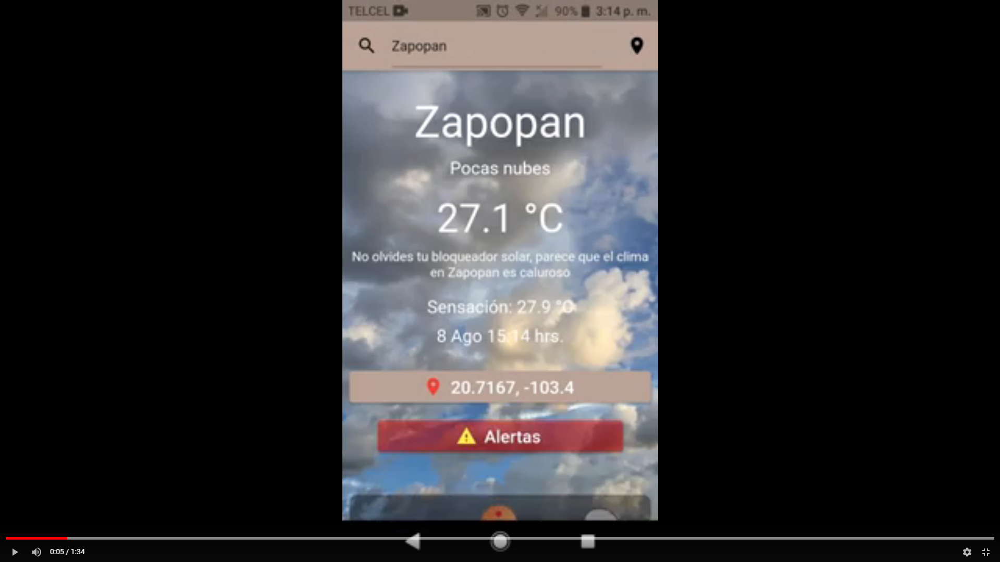

# Weather_app

Proyecto flutter para consultar el clima de cualquier parte del mundo buscando por nombre de ciudad o por coordenada

[](https://www.youtube.com/watch?v=VRmnae441b4)

## Comenzando 🚀

- Descargar y descomprimir el proyecto
- Descargar archivo apk del apardado releases

### Pre-requisitos 📋

_Necesario_

```
- Flutter instalado
- Clave Google Cloud Platform
- Clave de OpenWeather
```

### Instalación 🔧

_Pasos para correr proyecto_

_1. Ve a ./andoid/app/src/main/res/values/strings.xml_

```
- En API_KEY escribe tu clave de Google cloud platform ej: <string name="API_KEY">AizGp89....</string>
```

_1.2. Ve a ./lib/constants.dart_

```
- En ApiKey escribe tu clave de OpenWeather ej: const ApiKey = "e12e44far...";
```

## Despliegue 📦

_Crea las Aplicaciónes en modo release con el comando "flutter build apk" o conectando tu celular al ordenador con "flutter run --release"_

## Construido con 🛠️

_Para este proyecto se utilizó_

* [Flutter](https://flutter.dev/)
* [OpenWeather](https://openweathermap.org/api/)

## Autores ✒️

_Mencion a todos aquellos que ayudaron a levantar el proyecto desde sus inicios_

* **Alonso Alvarez** - *Codificacion y diseños* - [AlonsoAlvarez](https://github.com/AlonsoAlvarez)

---

⌨️ con ❤️ por [AlonsoAlvarez](https://github.com/AlonsoAlvarez) 😊# Weather_app
